# Uzbek Sign Language (UzSL) Dataset

This folder contains visual demonstrations of 50 Uzbek Sign Language signs with MediaPipe landmarks.

---

## assalomu_alaykum
<table align="center">
  <tr>
    <td align="center">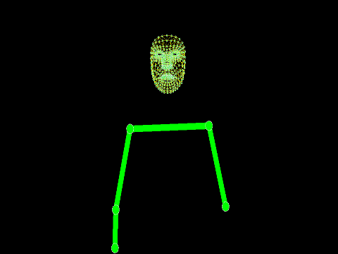 <b>Repetition 1</b></td>
    <td align="center">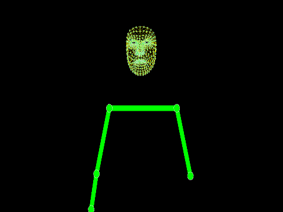 <b>Repetition 2</b></td>
  </tr>
</table>

---

## bahor
<table align="center">
  <tr>
    <td align="center">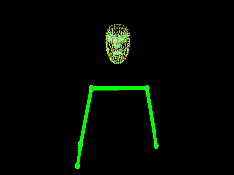 <b>Repetition 1</b></td>
    <td align="center">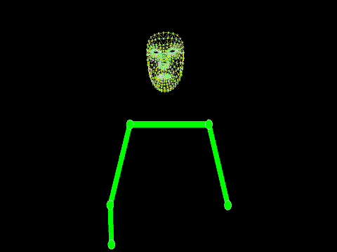 <b>Repetition 2</b></td>
  </tr>
</table>

---

## birga
<table align="center">
  <tr>
    <td align="center">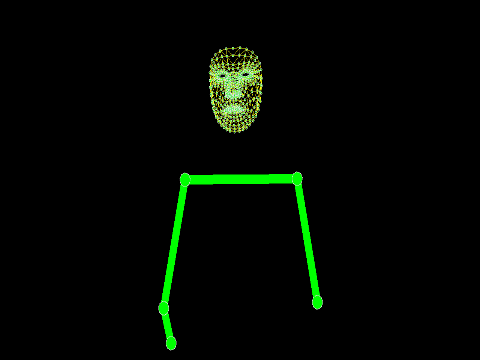 <b>Repetition 1</b></td>
    <td align="center">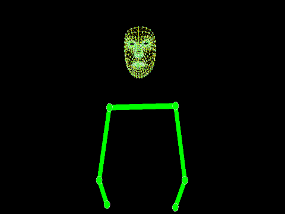 <b>Repetition 2</b></td>
  </tr>
</table>

---

## bo'sh
<table align="center">
  <tr>
    <td align="center"> <b>Repetition 1</b></td>
    <td align="center"> <b>Repetition 2</b></td>
  </tr>
</table>

---

## bosh_kiyim
<table align="center">
  <tr>
    <td align="center">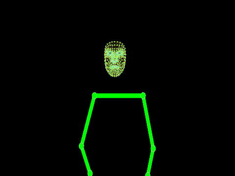 <b>Repetition 1</b></td>
    <td align="center">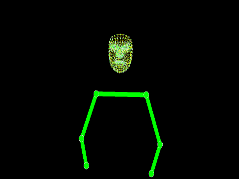 <b>Repetition 2</b></td>
  </tr>
</table>

---

## boshlanishi
<table align="center">
  <tr>
    <td align="center">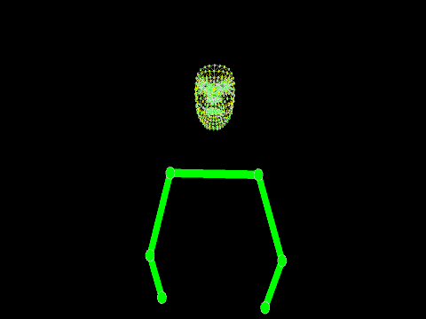 <b>Repetition 1</b></td>
    <td align="center">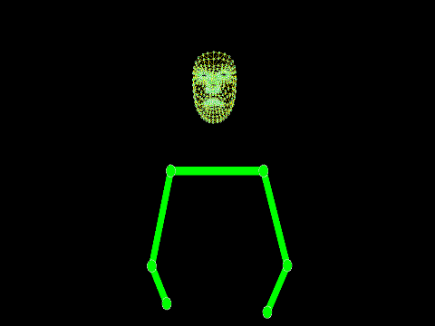 <b>Repetition 2</b></td>
  </tr>
</table>

---

## bozor
<table align="center">
  <tr>
    <td align="center">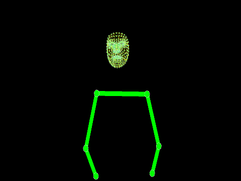 <b>Repetition 1</b></td>
    <td align="center">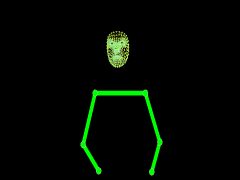 <b>Repetition 2</b></td>
  </tr>
</table>

---

## eshik
<table align="center">
  <tr>
    <td align="center">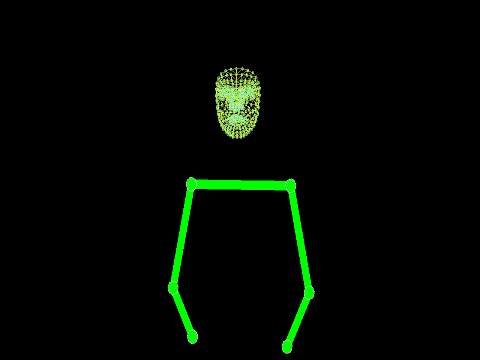 <b>Repetition 1</b></td>
    <td align="center">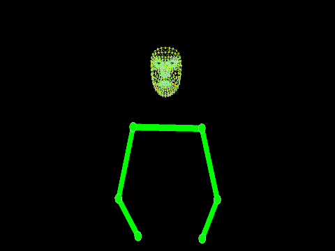 <b>Repetition 2</b></td>
  </tr>
</table>

---

## futbol
<table align="center">
  <tr>
    <td align="center">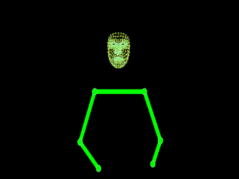 <b>Repetition 1</b></td>
    <td align="center">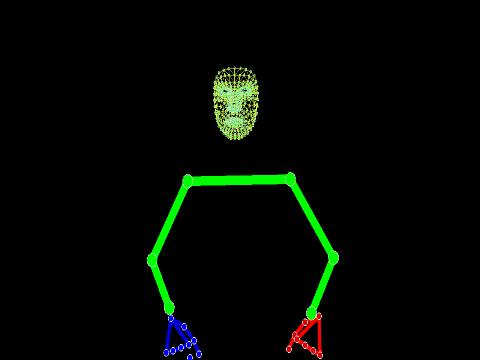 <b>Repetition 2</b></td>
  </tr>
</table>

---

## iltimos
<table align="center">
  <tr>
    <td align="center">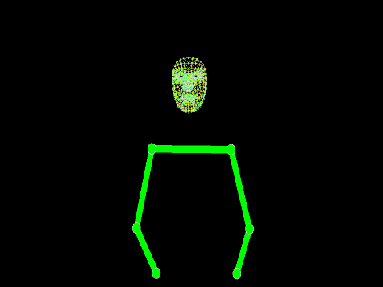 <b>Repetition 1</b></td>
    <td align="center">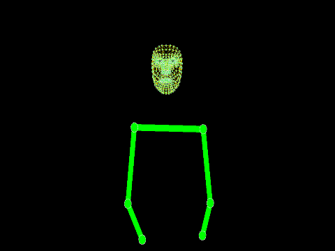 <b>Repetition 2</b></td>
  </tr>
</table>

---

## internet
<table align="center">
  <tr>
    <td align="center">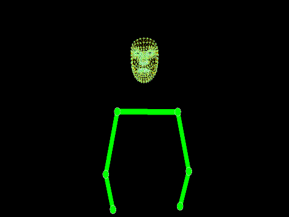 <b>Repetition 1</b></td>
    <td align="center">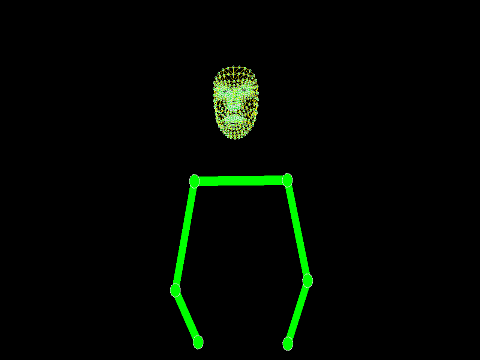 <b>Repetition 2</b></td>
  </tr>
</table>

---

## javob
<table align="center">
  <tr>
    <td align="center">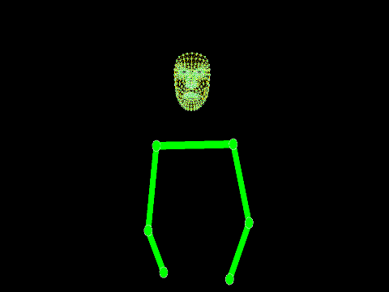 <b>Repetition 1</b></td>
    <td align="center">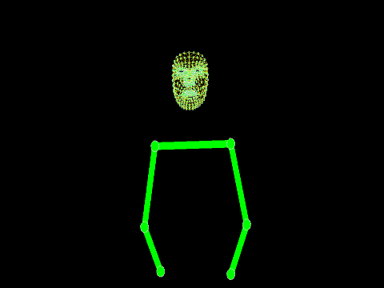 <b>Repetition 2</b></td>
  </tr>
</table>

---

## jismoniy_tarbiya
<table align="center">
  <tr>
    <td align="center">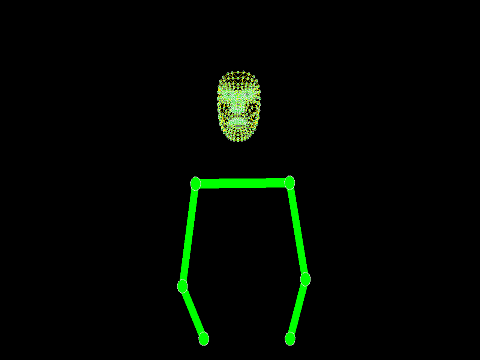 <b>Repetition 1</b></td>
    <td align="center">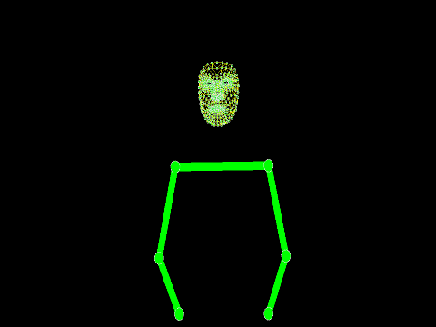 <b>Repetition 2</b></td>
  </tr>
</table>

---

## karam
<table align="center">
  <tr>
    <td align="center">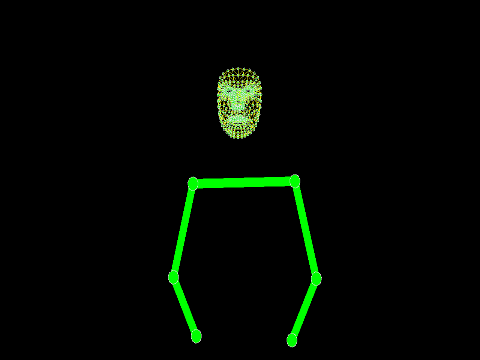 <b>Repetition 1</b></td>
    <td align="center">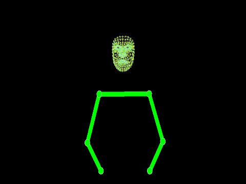 <b>Repetition 2</b></td>
  </tr>
</table>

---

## kartoshka
<table align="center">
  <tr>
    <td align="center">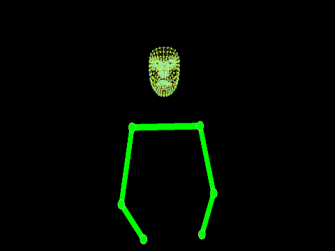 <b>Repetition 1</b></td>
    <td align="center">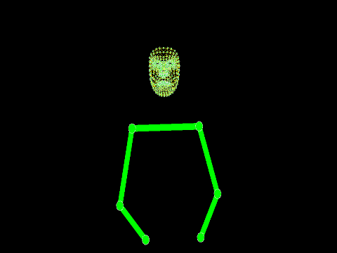 <b>Repetition 2</b></td>
  </tr>
</table>

---

## kichik
<table align="center">
  <tr>
    <td align="center">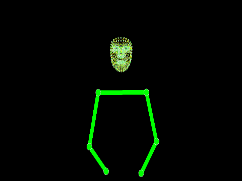 <b>Repetition 1</b></td>
    <td align="center">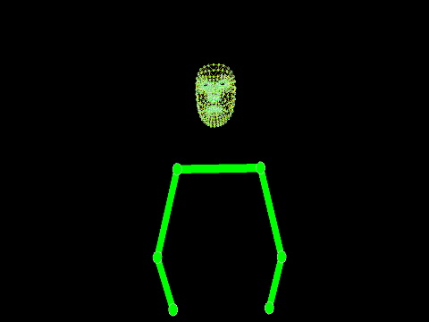 <b>Repetition 2</b></td>
  </tr>
</table>

---

## kitob
<table align="center">
  <tr>
    <td align="center">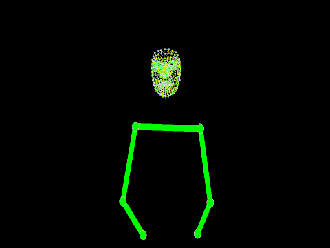 <b>Repetition 1</b></td>
    <td align="center"> <b>Repetition 2</b></td>
  </tr>
</table>

---

## ko'prik
<table align="center">
  <tr>
    <td align="center"> <b>Repetition 1</b></td>
    <td align="center"> <b>Repetition 2</b></td>
  </tr>
</table>

---

## likopcha
<table align="center">
  <tr>
    <td align="center">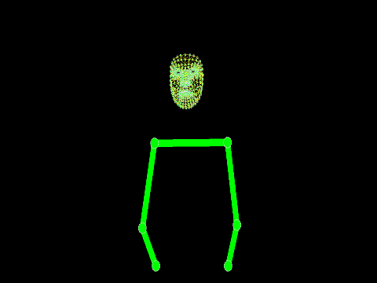 <b>Repetition 1</b></td>
    <td align="center">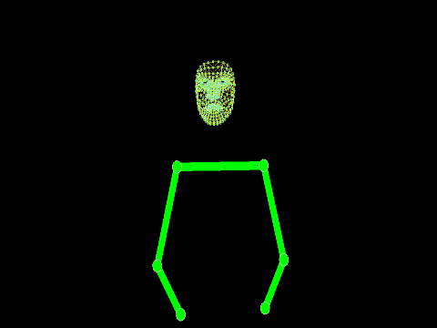 <b>Repetition 2</b></td>
  </tr>
</table>

---

## maktab
<table align="center">
  <tr>
    <td align="center">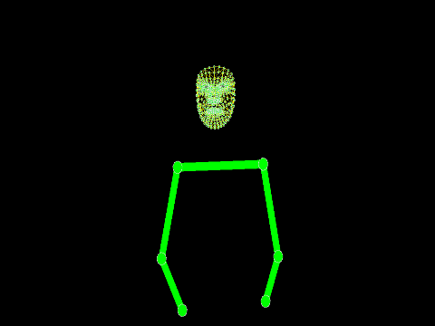 <b>Repetition 1</b></td>
    <td align="center">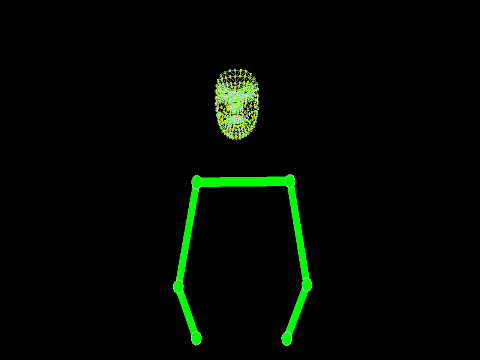 <b>Repetition 2</b></td>
  </tr>
</table>

---

## mehmonxona
<table align="center">
  <tr>
    <td align="center">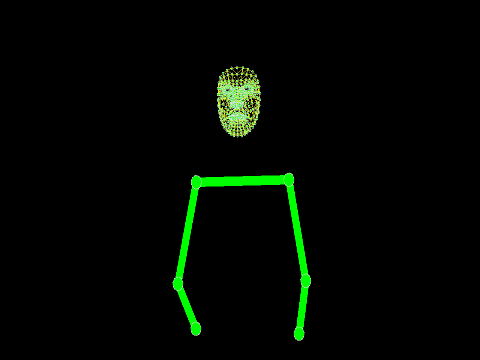 <b>Repetition 1</b></td>
    <td align="center">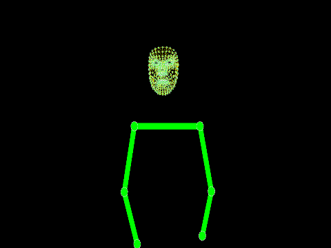 <b>Repetition 2</b></td>
  </tr>
</table>

---

## mehribon
<table align="center">
  <tr>
    <td align="center">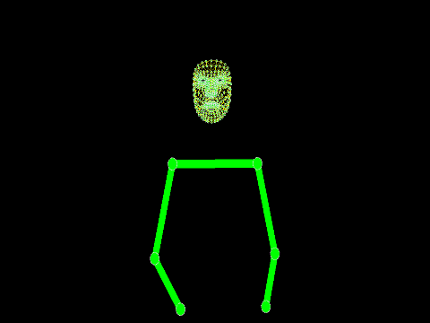 <b>Repetition 1</b></td>
    <td align="center">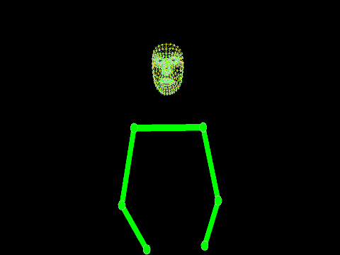 <b>Repetition 2</b></td>
  </tr>
</table>

---

## metro
<table align="center">
  <tr>
    <td align="center">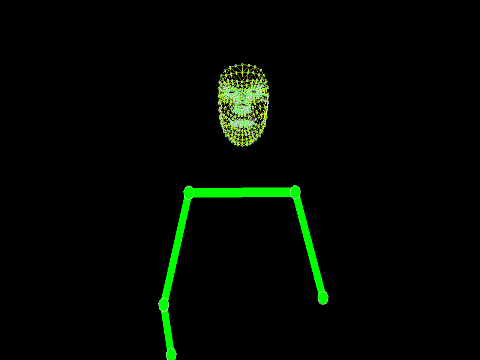 <b>Repetition 1</b></td>
    <td align="center">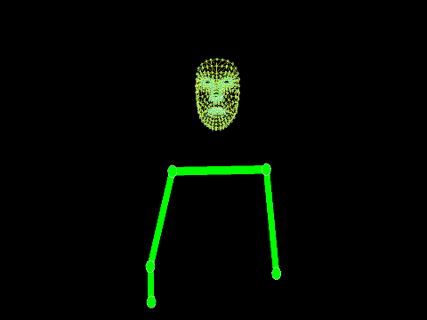 <b>Repetition 2</b></td>
  </tr>
</table>

---

## musiqa
<table align="center">
  <tr>
    <td align="center">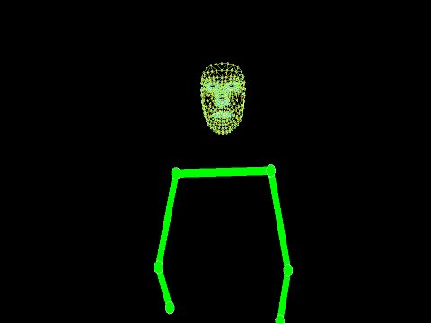 <b>Repetition 1</b></td>
    <td align="center">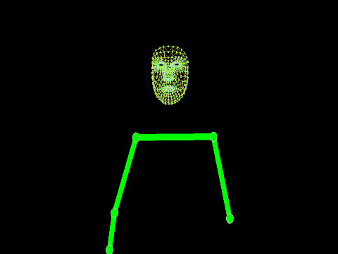 <b>Repetition 2</b></td>
  </tr>
</table>

---

## o'simlik_yog'i
<table align="center">
  <tr>
    <td align="center"> <b>Repetition 1</b></td>
    <td align="center"> <b>Repetition 2</b></td>
  </tr>
</table>

---

## o'ynash
<table align="center">
  <tr>
    <td align="center"> <b>Repetition 1</b></td>
    <td align="center"> <b>Repetition 2</b></td>
  </tr>
</table>

---

## ochish
<table align="center">
  <tr>
    <td align="center">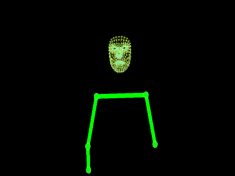 <b>Repetition 1</b></td>
    <td align="center">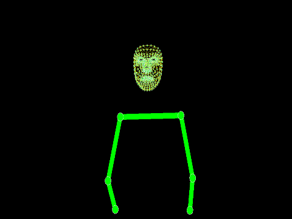 <b>Repetition 2</b></td>
  </tr>
</table>

---

## ot
<table align="center">
  <tr>
    <td align="center">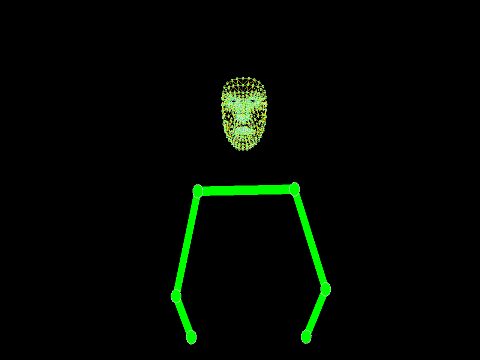 <b>Repetition 1</b></td>
    <td align="center">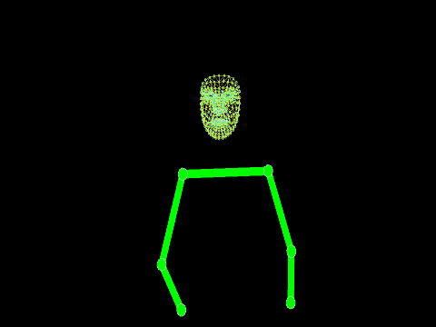 <b>Repetition 2</b></td>
  </tr>
</table>

---

## ovqat_tayyorlash
<table align="center">
  <tr>
    <td align="center">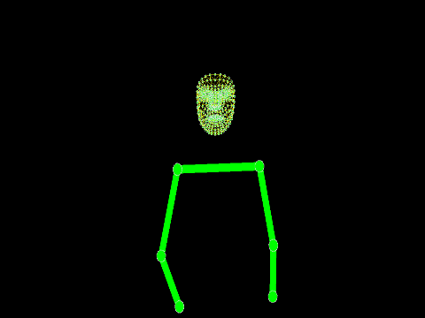 <b>Repetition 1</b></td>
    <td align="center">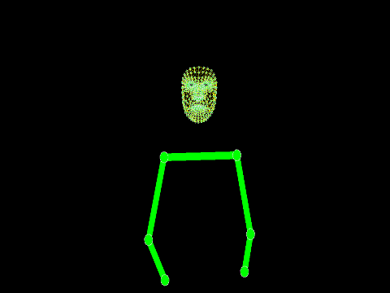 <b>Repetition 2</b></td>
  </tr>
</table>

---

## oxiri
<table align="center">
  <tr>
    <td align="center">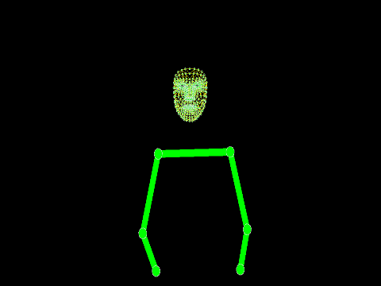 <b>Repetition 1</b></td>
    <td align="center"> <b>Repetition 2</b></td>
  </tr>
</table>

---

## poezd
<table align="center">
  <tr>
    <td align="center"> <b>Repetition 1</b></td>
    <td align="center"> <b>Repetition 2</b></td>
  </tr>
</table>

---

## pomidor
<table align="center">
  <tr>
    <td align="center"> <b>Repetition 1</b></td>
    <td align="center"> <b>Repetition 2</b></td>
  </tr>
</table>

---

## qidirish
<table align="center">
  <tr>
    <td align="center"> <b>Repetition 1</b></td>
    <td align="center"> <b>Repetition 2</b></td>
  </tr>
</table>

---

## qish
<table align="center">
  <tr>
    <td align="center"> <b>Repetition 1</b></td>
    <td align="center"> <b>Repetition 2</b></td>
  </tr>
</table>

---

## qo'ziqorin
<table align="center">
  <tr>
    <td align="center"> <b>Repetition 1</b></td>
    <td align="center"> <b>Repetition 2</b></td>
  </tr>
</table>

---

## qor
<table align="center">
  <tr>
    <td align="center"> <b>Repetition 1</b></td>
    <td align="center"> <b>Repetition 2</b></td>
  </tr>
</table>

---

## qorong'i
<table align="center">
  <tr>
    <td align="center"> <b>Repetition 1</b></td>
    <td align="center"> <b>Repetition 2</b></td>
  </tr>
</table>

---

## quyon
<table align="center">
  <tr>
    <td align="center"> <b>Repetition 1</b></td>
    <td align="center"> <b>Repetition 2</b></td>
  </tr>
</table>

---

## restoran
<table align="center">
  <tr>
    <td align="center"> <b>Repetition 1</b></td>
    <td align="center"> <b>Repetition 2</b></td>
  </tr>
</table>

---

## sariyog'
<table align="center">
  <tr>
    <td align="center"> <b>Repetition 1</b></td>
    <td align="center"> <b>Repetition 2</b></td>
  </tr>
</table>

---

## shokolad
<table align="center">
  <tr>
    <td align="center"> <b>Repetition 1</b></td>
    <td align="center"> <b>Repetition 2</b></td>
  </tr>
</table>

---

## sovun
<table align="center">
  <tr>
    <td align="center"> <b>Repetition 1</b></td>
    <td align="center"> <b>Repetition 2</b></td>
  </tr>
</table>

---

## stakan
<table align="center">
  <tr>
    <td align="center"> <b>Repetition 1</b></td>
    <td align="center"> <b>Repetition 2</b></td>
  </tr>
</table>

---

## televizor
<table align="center">
  <tr>
    <td align="center"> <b>Repetition 1</b></td>
    <td align="center"> <b>Repetition 2</b></td>
  </tr>
</table>

---

## tosh
<table align="center">
  <tr>
    <td align="center"> <b>Repetition 1</b></td>
    <td align="center"> <b>Repetition 2</b></td>
  </tr>
</table>

---

## toza
<table align="center">
  <tr>
    <td align="center"> <b>Repetition 1</b></td>
    <td align="center"> <b>Repetition 2</b></td>
  </tr>
</table>

---

## turish
<table align="center">
  <tr>
    <td align="center"> <b>Repetition 1</b></td>
    <td align="center"> <b>Repetition 2</b></td>
  </tr>
</table>

---

## yomg'ir
<table align="center">
  <tr>
    <td align="center"> <b>Repetition 1</b></td>
    <td align="center"> <b>Repetition 2</b></td>
  </tr>
</table>

---

## yopish
<table align="center">
  <tr>
    <td align="center"> <b>Repetition 1</b></td>
    <td align="center"> <b>Repetition 2</b></td>
  </tr>
</table>

---

## yordam_berish
<table align="center">
  <tr>
    <td align="center"> <b>Repetition 1</b></td>
    <td align="center"> <b>Repetition 2</b></td>
  </tr>
</table>

---

## Dataset Information

- **Total Signs:** 50
- **Repetitions per Sign:** 2
- **Frames per Repetition:** 32
- **Recording Method:** MediaPipe Holistic (Face, Pose, Hands)
- **Background:** Black with colored landmarks
- **Format:** Animated GIF (480px width)

### Color Coding
- **Green/Yellow:** Face mesh
- **Red:** Right hand landmarks
- **Blue:** Left hand landmarks
- **Green:** Upper body pose

